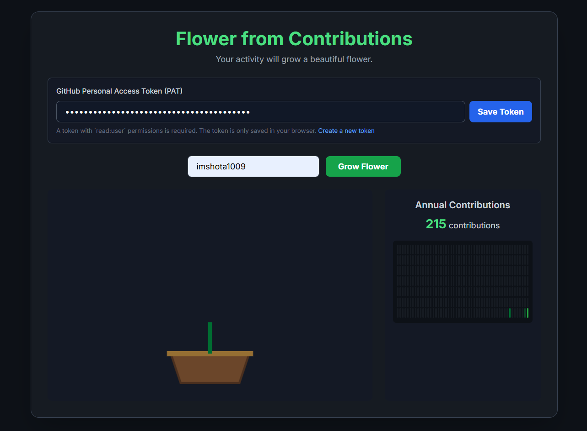

# 草で育つ花 🌸 (Contribution Flower)

あなたのGitHubでの日々の頑張り（草）を、  
美しい花を育てる力に変えるWebアプリケーションです。  

  
  
  
  

---

## 🌼 アプリについて (About)

自分の **GitHubユーザー名** と **Personal Access Token (PAT)** を入力するだけで、  
プライベートを含む全てのコントリビューションがリアルタイムで花の成長に反映されます。  

👉 [ここから自分の花の成長を確認できます](https://imshota1009.github.io/my-contribution-flower/)

---

## 📸 スクリーンショット

---

## ✨ 機能 (Features)

- **正確なデータ反映**  
  GitHub GraphQL APIを利用し、公開・非公開のコントリビューションを正確に取得。  

- **成長の可視化**  
  草（Contribution）に応じて、種 → 芽吹き → 葉 → 満開の花へと変化。アニメーションで成長を楽しめます。  

- **安全な設計**  
  入力されたPATはブラウザの `localStorage` のみに保存され、外部サーバーには送信されません。  

---

## 🚀 使い方 (How To Use)

このアプリを利用するには、**GitHub Personal Access Token (PAT)** が必要です。  

### 1. PATの作成方法

1. [こちら](https://github.com/settings/tokens/new) から新しいPAT作成ページを開く  
2. **Note**: `Contribution Flower Viewer` など分かりやすい名前  
3. **Expiration**: セキュリティのため *90 days* 推奨  
4. **Scopes**: `read:user` のみチェック  
5. ページ下部の **Generate token** をクリック  
6. `ghp_` から始まるトークンをコピー（1回しか表示されません！）  

---

### 2. 花を育てる

1. アプリを開く  
2. **GitHubユーザー名** を入力  
3. **PAT** を入力  
4. **「花を育てる」** ボタンをクリック  
5. あなたの草が、美しい花として画面に咲き誇ります 🌸  

---

## ⚠️ セキュリティについて

- PATはパスワードと同じくらい重要です。  
  **他人と共有・公開リポジトリにコミットしないでください。**  
- 本アプリはPATを **ブラウザのlocalStorageのみに保存** し、外部送信は一切行いません。  
- 公共のPCでの利用は避けてください。  

---

## 🛠️ 使用技術 (Technologies Used)

- **HTML5**: 基本構造  
- **Tailwind CSS**: スタイリング  
- **JavaScript (ES6+)**: アプリロジック  
- **GitHub GraphQL API v4**: コントリビューションデータ取得  

---

